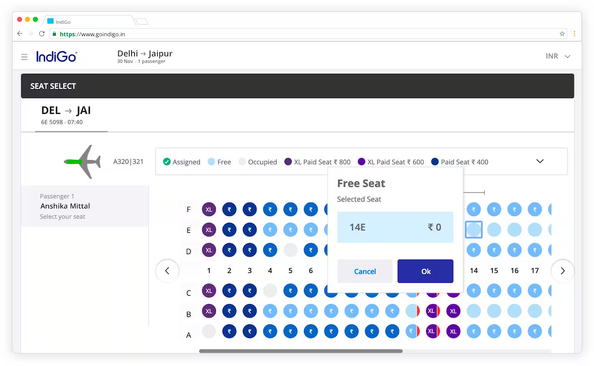

# Plane Seating Chart Assignment

## Objective

Build a Plane Seating Chart component in React that renders a dynamic seating layout based on improved plane configurations.

### Example output:



## Requirements

### 1. Plane Selection

- Create a **Dropdown** to select a plane model.
- There are 3 plane configurations available (Mock data provided in `src/data/planes.json`):
  - **Model 1**: 2 Sections [4, 4] rendered as: 4 seats | aisle | 4 seats
  - **Model 2**: 3 Sections [3, 2, 3] rendered as: 3 seats | aisle | 2 seats | aisle | 3 seats
  - **Model 3**: 3 Sections [3, 3, 3] rendered as: 3 seats | aisle | 3 seats | aisle | 3 seats

### 2. Seating Chart Rendering

- The input data is a array of seat objects (provided in `src/data/seats.json`).
- You must write logic to render the seating chart that matches the selected plane's configuration.
- Render the seats visually. Distinctly show the sections (columns) (e.g., aisle separation).
- Display the price of each seat on hover in a tooltip.

### 3. Interaction

- **Select/Deselect**: Clicking a seat should toggle its selection state.
- **Booking**: Add a "Book Selected Seats" button.
  - Clicking it should trigger a API call.
  - Mock the API call using `setTimeout`.
  - On success, display the updated status of the selected seats.
  - On failure, show an error message.

### 4. Constraints

- Use **React** function components and Hooks.
- Use **TypeScript**.
- Styling can be CSS, SCSS, or Tailwind (your choice). Make it look decent.

## Data Structure

### Seat Object

```json
{
  "id": "1A",
  "row": 1,
  "col": "A",
  "price": 100,
  "isBooked": false
}
```

### Plane Config

```json
{
  "id": "model-1",
  "name": "Boeing 737",
  "sections": [3, 3] // Example
}
```

## Bonus

- Handle "Booked" seats visually (disable them).
- Show total price of selected seats.
